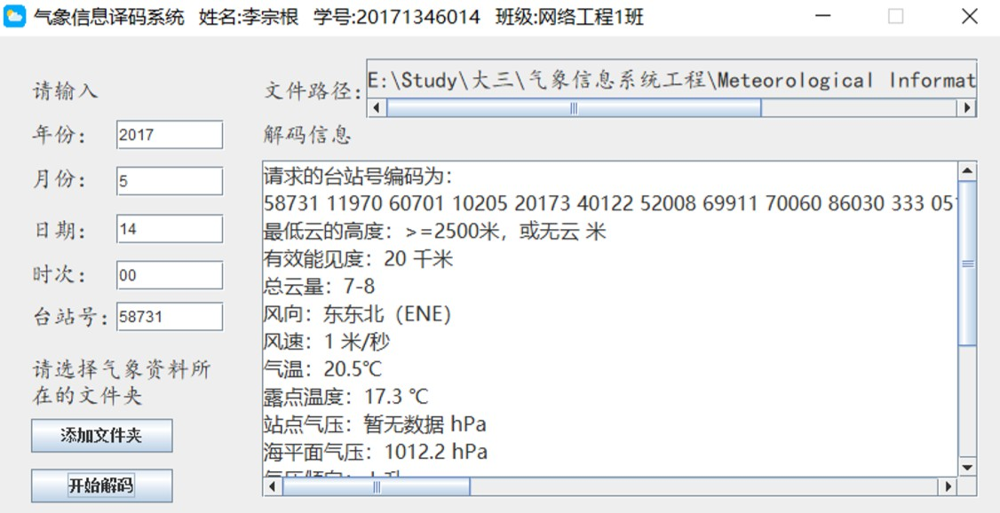

# 地面气象报文译码器
## 概述

1. 根据世界气象组织规定的国际通用的陆地测站地面天气预报点码编码规则，通过java读取并处理文件，并将结果通过JFrame图形界面框架显示在前端，实现对报文的编码
2. 编译工具 MyEclipse 2017 CI
3. 编码规则请见 ./src/报文编码规则/气象地面报文电码编码规则.doc

## 系统效果图

1. 输入年份：2017，月份：5，日期：14，时次：00，台站号：58731，并选择 src/地面资料 文件夹

   